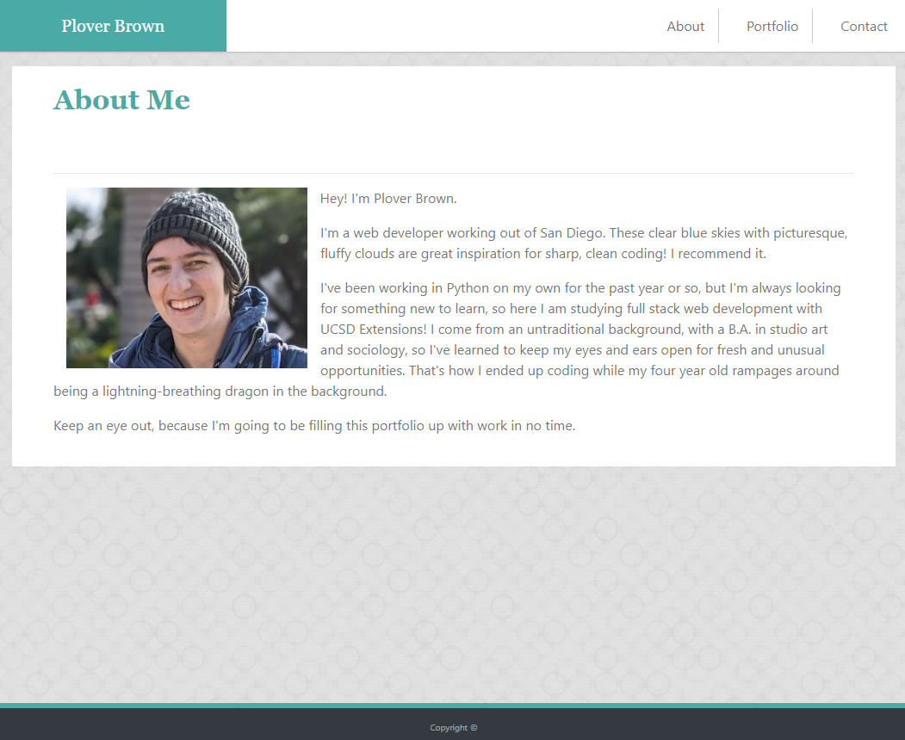

# Portfolio #

### Professional portfolio for Plover Brown ###

https://rebgrasshopper.github.io/portfolio/

## Table Of Contents ##

- [Section 1: Introduction](#introduction)
- [Section 2: Usage](#usage)
- [Section 3: Credits](#credits)
- [Section 4: License](#license)

## Introduction ##

I'm Plover Brown, and this is my professional portfolio. In it you'll find the projects I've been working on. It is built using Bootstrap 4, relying on the grid system and some flexbox CSS as well.

## Usage ##

Anyone is free to find the source code here on GitHub. You can access the files through cloning the repo, and the link underneath the website screenshot will take you to the live page. It should be responsive on a wide variety of devices and browsers.

## Credits ##

Thank you to all the members of my study group for hours of working together!

## License ##

GNU General Public License